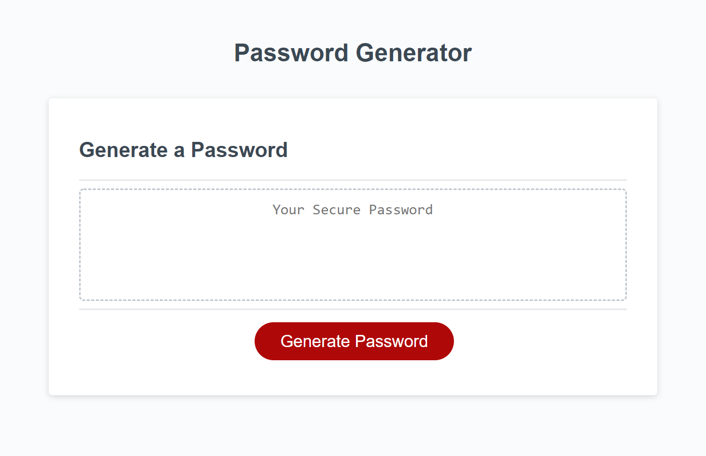
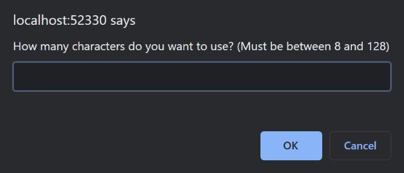
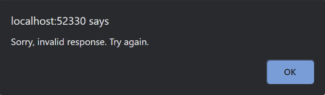
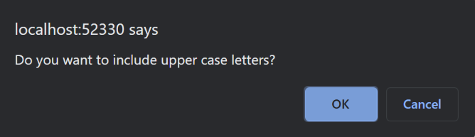
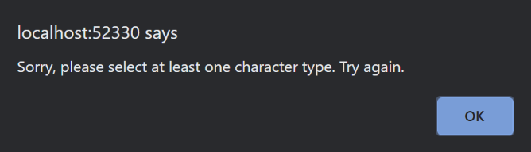
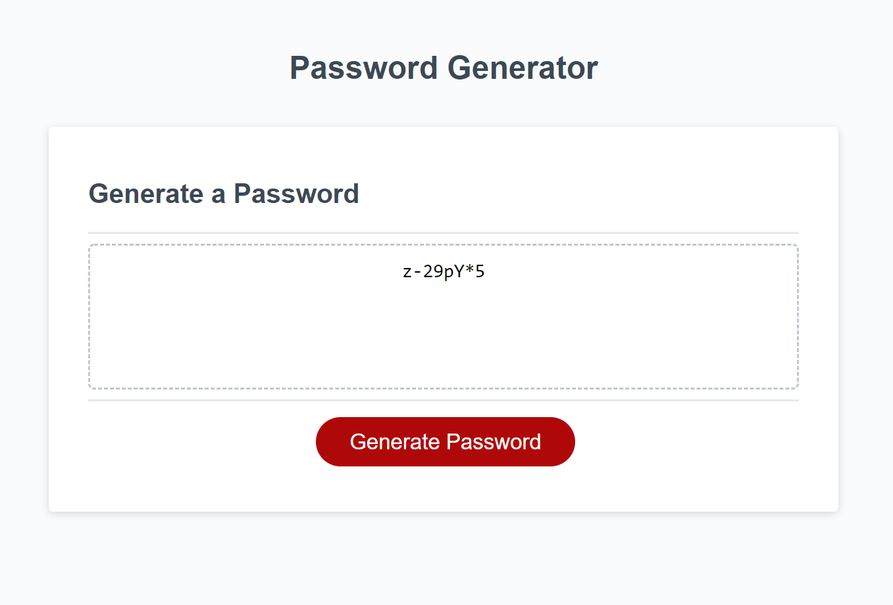

# Secure Password Generator

[Click here](https://wijeremy.github.io/Secure-Password-Generator/) to be taken to the Secure Password Generator website.
## Introduction
I was tasked with writing Java Script for a website that would generate a random password with attributes chosen by the user. I was asked to prompt the user for these attributes using pop up windows. The password that is generated could either be displayed in a following pop up or in a text box on the original website. The html and css were provided, as well as some Java Script to get me started:

This is what the website looks like, with html and css provided:



And this is the Java Script I was provided:
```javascript
// Assignment Code
var generateBtn = document.querySelector("#generate");

// Write password to the #password input
function writePassword() {
  var password = generatePassword();
  var passwordText = document.querySelector("#password");

  passwordText.value = password;
}

// Add event listener to generate button
generateBtn.addEventListener("click", writePassword);
```

In short I was given the following To Do list:
  * Pop up windows will ask for
    * How long the user wants the password to be (8 <= characters <= 128)
    * Which characters the user would like from a list of
      * Upper case letters
      * Lower case letters
      * Numbers
      * Special Characters
  * Generate a password with the chosen criteria
  * Display that password to the user

But to get started, I create a function named generatePassword() to pass into the variable password. What follows is inside that function.
## User Prompts
This part was rather straight forward. I first want to use the prompt function to ask for a number between 8 and 128 (inlcusive). To make sure the input is what I want, I pass it through the following if statement:

```javascript
  if (ammount == null || ammount<8 || ammount>128 || isNaN(ammount)) {
    window.alert("Sorry, invalid response. Try again.");
    return
  }
```

This tells our generatePassword() function to alert the user and pass an empty result if they hit cancel, input a number less than 8 or more than 128, or input something that wasn't a number.

Then I want to use the confirm function to ask which character types the user wants. I also need them to select at least one character type, so I use a similar if statement as above, but for if the user hit cancel on each confirm window.

All in all, the following pop ups could be displayed:

Asking the user how many characters they want included:


...

Alerting the user they need to input a valid value:



(note: after this window, the function stops and the user must start again)

...

Asking the user which characters they want included:



etc.

...

Alerting the user that they need to select at least one character type:



(note: like previously, this stops the function and the user must start again)

## Generating the Password
The user has now told us everything we need to know, and now we need to give them what they asked for. The first thing to do is make a bank of the characters we could put in a password. I made an array for each character type, but I'm sure there was an easier way to do this. Ultimately this made things pretty complicated, but at least I think I understand everything I wrote instead of copy and pasting from the internet (though I really tried to get that to work; this just got too dense too quickly). 

Then, once I have my character arrays built, I check each character type input from the user and, if they wanted it, I push its array into another array, char.

Now I have an array, char, which contains all the character types the user is happy including. I then choose a random array from char, and then a random character from that array. I then push that character into another array, myPassword. I then repeat this process, using a for loop, a number of times equal to the password length chosen by the user.

Ultimately I will have an array, myPassword, with a length chosen by the user. It will only contain characters from the character type(s) chosen by the user. With this process, there is also an equal likelyhood any character type will be included, despite some types being much larger than others. 

At this point, one could make the argument that the assignment is completed. However, I was unhappy with the possibility that not ALL of the character types chosen by the user would be included. 

## Checking the Password
I would like to direct your attention to this bit of Java Script:

```javascript
for (var i = 0; i < char.length; i++) {
  for (var j = 0; j < char[i].length; j++) {
    for (var k = 0; k < myPassword.length; k++ ) {
      if (char[i][j] == myPassword[k]) {
        isGood[i] = true;
      };
    };
  }; 
};
```

Now, it's important to note, that while we were pushing the chosen character types into char, we were also pushing the value "false" into another array, isGood. This ensured that there were as many values in in isGood as there were in char. 

Simple, right?

This took me an entire night to work out. In hindsight it seems straight forward. But wrapping my mind around anywhere from 80 to 12,160 loops, and what should be done at any moment, finding key moments to maybe pivot and do something else, it was just way over my head at first. The paradigm shift happend for me the following morning when I came up with the isGood array. This allowed me to pass a true value into a new array at index i if a character from the array at char[i] was ever in myPassword. What's more, I could pass true multiple times and not affect my outcome. 

Finally, I can loop through isGood and, if any value is false -- meaning the array of characters at char[i] was not used, I could reset myPassword, loop through isGood to set all its values to false, and start over from the top of getPassword.

This way, we ensure that every chosen character type is used.

## Display the Password
This was actually handled in the code that was proveded to me. If the password is returned in generatePassword(), then it is displayed in the text box on the website. The only trick was to return the array myPassword as a string without any unwanted commas. This was handled with 
```javascript
.join("")
```


